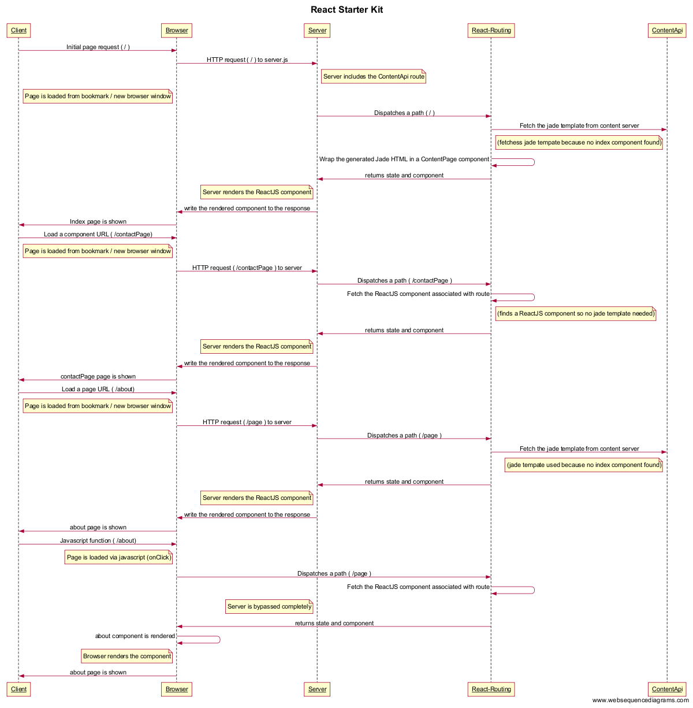

# Introduction

## Starting the app

When you run ```npm start```, it will 

- launch Node.js app at http://localhost:5000
- fires up Browsersync on top of it that runs on http://localhost:3000/ and injects Browsersync and HMR specific JavaScript code into web pages


# Routing



## Routes

When it comes to routing, there are 2 important components that come into play:

### Frontend routing

The frontend router (```/src/routes.js```) is implemented using [react-routing](https://github.com/kriasoft/react-routing).

### Server routing

There are 2 parts where server based routing comes into play 

- the REST endpoints that the application exposes (```/src/api/content.js```)
- the server-side page rendering (```/src/server.js```)

```
curl -v http://localhost:3001/api/content?path=index
```

### Content API

The React Starter kit contains a content API that is exposed on ```api/content```.

It is included like this in ```server.js```

```
server.use('/api/content', require('./api/content'));
```

You can query the content API using curl like this:

```
curl -v http://localhost:3000/api/content?path=index


{"path":"index","content":"<div><div><h3>Runtime Components....</h3><dl><dt><a href=\"https://facebook.github.io/react/\">React</a></dt><dd>A JavaScript library for building user interfaces, developed by Facebook</dd><dt><a href=\"http://facebook.github.io/flux/\">Flux</a></dt><dd>Application architecture for building user interfaces</dd></dl></div><div><h3>Development Tools</h3><dl><dt><a href=\"http://webpack.github.io/\">Webpack</a></dt><dd>Compiles front-end source code into modules / bundles</dd><dt><a href=\"http://www.browsersync.io/\">BrowserSync</a></dt><dd>A lightweight HTTP server for development</dd></dl></div><div><h3>Fork me on GitHub</h3><p><a href=\"https://github.com/kriasoft/react-starter-kit\">github.com/kriasoft/react-starter-kit</a></p></div></div>","title":"React.js Starter Kit","component":"ContentPage"}
```

The content API return a JSON structure


A simple React component looks like this:

```
/*! React Starter Kit | MIT License | http://www.reactstarterkit.com/ */

import React, { Component } from 'react';
import s from './Feedback.scss';
import withStyles from '../../decorators/withStyles';

@withStyles(s)
class Feedback extends Component {

  render() {
    return (
      <div className={s.root}>
        <div className={s.container}>
          <a className={s.link} href="https://gitter.im/kriasoft/react-starter-kit">Ask a question</a>
          <span className={s.spacer}>|</span>
          <a className={s.link} href="https://github.com/kriasoft/react-starter-kit/issues/new">Report an issue</a>
        </div>
      </div>
    );
  }

}

export default Feedback;
```

The most interesting part here is 

- the use of ES6 classes
- the import statements used
- the use of stylesheets
- 

The stylesheet associated with this component is this :

```
/* React Starter Kit | MIT License | http://www.reactstarterkit.com/ */

@import '../variables.scss';

.root {
  background: #f5f5f5;
  color: #333;
}

.container {
  margin: 0 auto;
  padding: 20px 8px;
  max-width: $max-content-width;
  text-align: center;
  font-size: 1.5em; /* ~24px */
}

.link,
.link:active,
.link:hover,
.link:visited {
  color: #333;
  text-decoration: none;
}

.link:hover {
  text-decoration: underline;
}

.spacer {
  padding-right: 15px;
  padding-left: 15px;
}


```
And the generated HTML :

```
<div class="Feedback_root_LW7" data-reactid=".12aelg8qk1s.2">
	<div class="Feedback_container_3dV" data-reactid=".12aelg8qk1s.2.0">
		<a class="Feedback_link_17l" href="https://gitter.im/kriasoft/react-starter-kit" data-reactid=".12aelg8qk1s.2.0.0">Ask a question</a>
		<span class="Feedback_spacer_Iut" data-reactid=".12aelg8qk1s.2.0.1">|</span>
		<a class="Feedback_link_17l" href="https://github.com/kriasoft/react-starter-kit/issues/new" data-reactid=".12aelg8qk1s.2.0.2">Report an issue</a>
	</div>
</div>
```

Notice how the CSS styles are auto-generated (Feedback_root_LW7)

```
.Feedback_root_LW7 {
    background: #f5f5f5;
    color: #333;
}      
```


## Release mode

Using the release flag on ```start```,```build```,```deploy```,...

```
npm start -- --release
```

## API calls

Performing api calls


```
on('/products', async () => {
  const response = await fetch('http://api.example.com/products');
  const products = await response.json();
  return <ProductsPage {...products} />;
});
```
