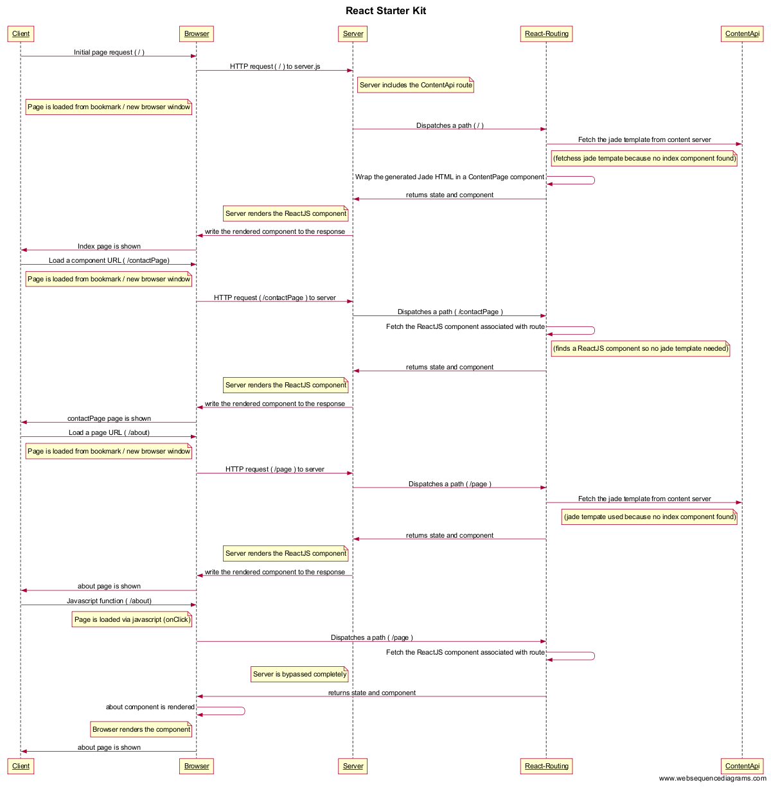

# Routing



# WebSequenceDiagrams

Paste the following text in [WebSequenceDiagrams](https://www.websequencediagrams.com/)

[Latest version at the time of writing](https://www.websequencediagrams.com/?lz=dGl0bGUgUmVhY3QgU3RhcnRlciBLaXQKCkNsaWVudC0-QnJvd3NlcjogSW5pdGlhbCBwYWdlIHJlcXVlc3QgKCAvICkKAB0HLT5TZXJ2ZXI6IEhUVFAAFg4gdG8gcwAZBS5qcwpub3RlIHJpZ2h0IG9mIAAwBiA6AAEIaW5jbHVkZXMgdGhlIENvbnRlbnRBcGkgcm91dGUANgZsZWYANgUAgRcHIDogUGFnZSBpcyBsb2FkZWQgZnJvbSBib29rbWFyayAvIG5ldyBiACYHd2luZG93CgCBJwYtPgCBeAUtUm91dGluZzogRGlzcGF0Y2hlcyBhIHBhdGgAgTcKcgAlBXIAJAYKACsNLT4AgR8KOiBGZXRjaACBOgVqYWRlIHRlbXBsYXRlAIEQBmMAgUwGAIIIBwCBQg4AOQwoZmUAgQIFcwA7CmF0ZSBiZWNhdXNlIG5vIGluZGV4IGNvbXBvbmVudCBmb3VuZCkAgQkQAIFRD1dyYXAAglUFZ2VuZXJhdGVkIEphZGUgSFRNTCBpbiBhAIJrCACCTQUAVAkAgV8QAINjCHJldHVybnMgc3RhdGUgYW5kACgLAIMeDQCEFAgAg2cHcmVuZGVyAINeBgCEegVKUwBiCwCDFAgAg1YKd3JpdGUAhA0FADQGZQBeCyB0bwATB3Nwb25zZQCFBwoAhUAGOiBJAIIlBQCFNgVpcyBzaG93bgoAhVETTG9hZCBhAIJHC1VSTCAoIC9jb250YWMAgg0FKQCEN0oAhhYhAGwLAIY2DACFDS0AMxEAhSgdAIV9DwCFPgoAgxIRIGFzc29jaQCEOwV3aXRoAIcSDACHUQkAhkwPKGZpbmRzIGEAOxNzbyBubwCGHw9uZWVkZQCFPhIAg0yBLgCDOAwAhHEPAIRnGACKXQUAhHMHYWJvdXQAhAhsAItaBQCENTgAMwoAiTxvAIoVDXVzZWQAihsMAII_BQCKBiEAiCOBLgCBTgYAiTAhSmF2YXNjcmlwdCBmdW5jdGlvbgCEJTF2aWEgagA-CihvbkNsaWNrAI9sCwCDcSoAiBpWAIxMF2lzIGJ5cGFzcwCMJQdsZXRlbHkAjygQAJFYCQCNLhwAkVkJAJIGCQCERRBpcwCNEAkAkQ4VOgCRIwkAjW4MAE8TAINHGw&s=rose)

```
title React Starter Kit

Client->Browser: Initial page request ( / )
Browser->Server: HTTP request ( / ) to server.js
note right of Server : Server includes the ContentApi route
note left of Browser : Page is loaded from bookmark / new browser window
Server->React-Routing: Dispatches a path ( / ) to react-routing
React-Routing->ContentApi: Fetch the jade template from content server
note left of ContentApi: (fetchess jade tempate because no index component found)
React-Routing->React-Routing: Wrap the generated Jade HTML in a ContentPage component
React-Routing->Server: returns state and component
note left of Server: Server renders the ReactJS component
Server->Browser : write the rendered component to the response
Browser->Client: Index page is shown


Client->Browser: Load a component URL ( /contactPage)
note left of Browser : Page is loaded from bookmark / new browser window
Browser->Server: HTTP request ( /contactPage ) to server
Server->React-Routing: Dispatches a path ( /contactPage ) to react-routing
React-Routing->React-Routing: Fetch the ReactJS component associated with route
note right of React-Routing: (finds a ReactJS component so no jade template needed)
React-Routing->Server: returns state and component
note left of Server: Server renders the ReactJS component
Server->Browser : write the rendered component to the response
Browser->Client: contactPage page is shown

Client->Browser: Load a page URL ( /about)
note left of Browser : Page is loaded from bookmark / new browser window
Browser->Server: HTTP request ( /page ) to server
Server->React-Routing: Dispatches a path ( /page ) to react-routing
React-Routing->ContentApi: Fetch the jade template from content server
note left of ContentApi: (jade tempate used because no about component found)
React-Routing->Server: returns state and component
note left of Server: Server renders the ReactJS component
Server->Browser : write the rendered component to the response
Browser->Client: about page is shown


Client->Browser: Javascript function ( /about)
note left of Browser : Page is loaded via javascript (onClick)
Browser->React-Routing: Dispatches a path ( /page )
React-Routing->React-Routing: Fetch the ReactJS component associated with route
note left of Server: Server is bypassed completely
React-Routing->Browser: returns state and component
Browser->Browser: about component is rendered
note left of Browser: Browser renders the component
Browser->Client: about page is shown
```
